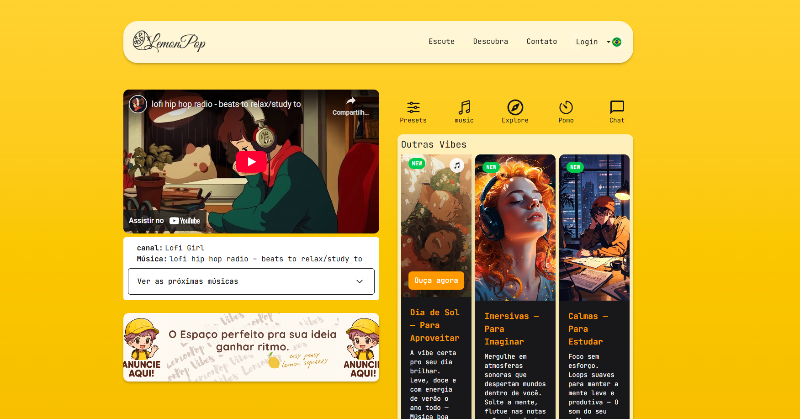

# 🍋 LemonPop  

  

## 🎶 Sobre o Projeto  
O **LemonPop** é um espaço dedicado a reunir e compartilhar as melhores playlists de **lofi** do YouTube.  
A proposta é unir **design moderno + música relaxante**, criando uma experiência única para quem busca estudar, pensar, relaxar ou simplesmente aproveitar o dia.  

Mais que um site, o LemonPop é uma **marca** que mistura a calma do lofi com a energia vibrante de um limão fresco.

  

## ✨ Categorias de Playlists  

- 🎧 **Imersivas — Para Imaginar**  
  *Mergulhe em atmosferas sonoras que despertam mundos dentro de você.*  
  © LemonPop — Imaginação tem trilha sonora.  

- 🌌 **Contemplativas — Para Pensar**  
  *Pensamentos profundos merecem música à altura.*  
  © LemonPop — Onde o silêncio pensa com ritmo.  

- 📚 **Calmas — Para Estudar**  
  *Foco sem esforço. Loops suaves para manter a mente leve e produtiva.*  
  © LemonPop — O som do seu melhor momento de concentração.  

- 🌞 **Dia de Sol — Para Aproveitar**  
  *A vibe certa pro seu dia brilhar.*  
  © LemonPop — Música boa com gosto de liberdade.  

## 💡 Desenvolvimento do projeto

Atualmente, o LemonPop encontra-se em fase de desenvolvimento e será disponibilizado em breve. Este projeto, concebido como parte de um portfólio, terá sua versão de consulta acessível ao público. No entanto, a versão oficial, que incluirá serviços de backend e integração com banco de dados, será mantida como privada.

- **Responsividade do site:** Site otimizado com Tailwind para melhor experiência do usuário nas versões desktop e mobile. - (Concluído).
- **Sistema de Playlists:** O sistema de listas está funcionando e aos poucos serão implementadas novas features - (Concluído).
- **Páginas a serem implementadas:**
  - Homepage: Estrutura principal do projeto - (Concluído).
  - Descubra: Página de playlist com categorias separadas para que o usuário possa navegar por diferentes estilos - (Em planejamento).
  - Doação: Página de acesso para doação ao projeto por meios de pagamento online. - (Em planejamento).
- **Header menu:** Atualmente o menu do Header não está funcionando pois depende da criação das paginas adicionais - (Em desenvolvimento).  
- **Main Display menu:** As features contarão com presets de clima para ruído branco, pomodoro, chat ao vivo e listas adicionais - (Em planejamento).
- **Sistema de envio de email:** A página com um formulário para envio de email e contato direto com o desenvolvedor. - (Em desenvolvimento).
- **Escolha de idiomas:** Campo para que o usuário possa escolher seu idioma de prefência. - (Em estruturação).

## 🖥️ Estrutura do Site  

- **Header:** Menus organizadas por paginas.
- **Home:** Destaque das playlists organizadas por categoria. 
- **Descubra:** Página dedicada para cada vibe (Imaginar, Pensar, Estudar, Aproveitar).  
- **Login:** Espaço para o usuário gerenciar seu perfil e poder participar do chat ao vivo.  
- **Sobre:** História da LemonPop e conceito da marca.  
- **Contato:** Para parcerias e sugestões.

## Nota Pessoal  

> "Programar é a minha vibe — e o lofi é o que acalma meus pensamentos. Unir os dois é criar um mundo onde tudo faz sentido."  

Essa é a essência do LemonPop: **código + música + criatividade**.  

---

## 🚀 Tecnologias Planejadas  

- **Tecnologias:** Next + TypeScript + TailwindCSS  
- **Banco de Dados:** Firebase  
- **Hospedagem:** Firebase Hosting / Fire Store  
- **Design:** Identidade visual criada em estilo chibi/anime  
